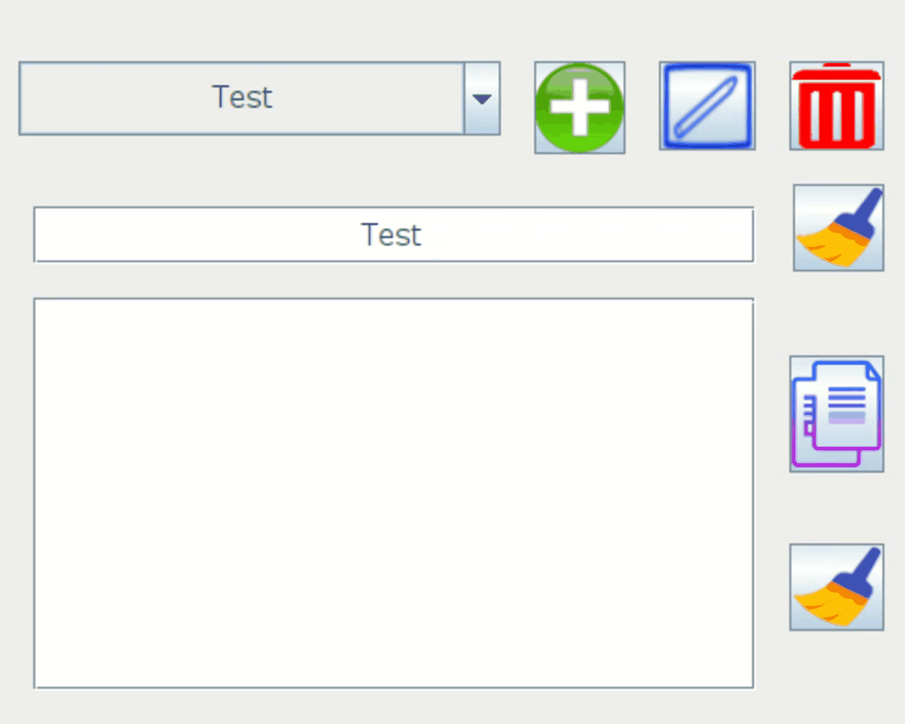
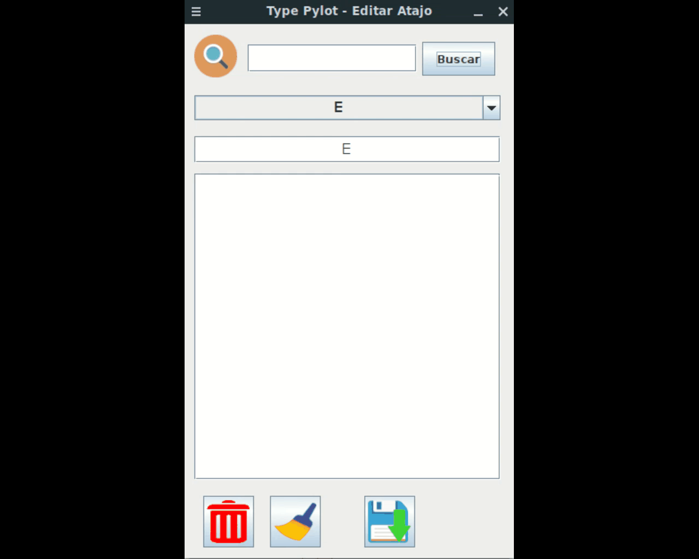

# Type-Pilot-Updated Automatic Text

Type Pilot Clon. 

This program will save you time when you want to write any text that you use frequently.

You create a shortcut, for example "test" and pressing enter will show the text associated with the shortcut called "test".

